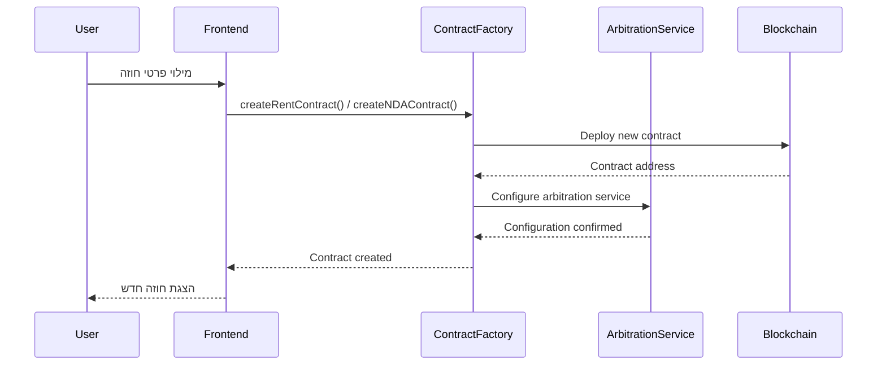
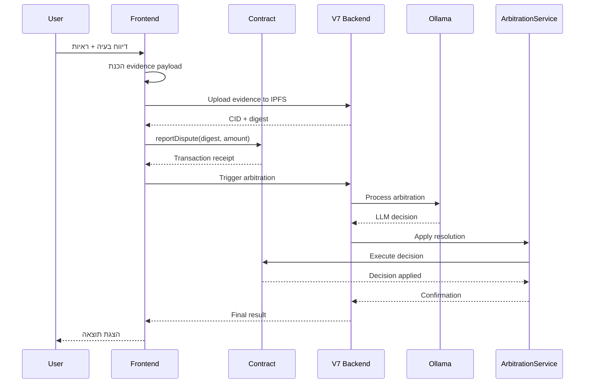
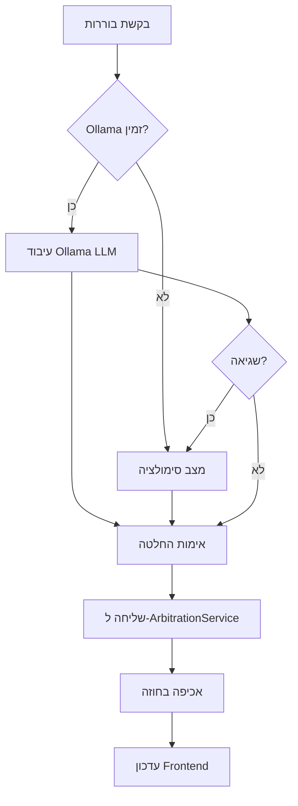

# ArbiTrust - איפיון מקיף ומעמיק

## תקציר פרויקט

**ArbiTrust** הוא מערכת חוזים חכמים עם בוררות מונעת AI לניהול מחלוקות אוטומטי. המערכת מספקת תבניות חוזים (NDA ושכירות) עם מנגנוני בוררות מתקדמים המשתמשים ב-Ollama LLM ו-Chainlink Functions.

### מהדורה נוכחית: V7 (אוקטובר 2025)
- אינטגרציה ישירה עם Ollama LLM 
- Backend מאוחד ב-Node.js (ללא תלות Python)
- מערכת גיבוי עם סימולציה חכמה
- Merkle Evidence Batching לחיסכון בגז
- E2E testing מתקדם

---

## ארכיטקטורה כללית

### רכיבים עיקריים

```
┌─────────────────────────────────────────────────────────────────┐
│                    ArbiTrust V7 Architecture                     │
├─────────────────────────────────────────────────────────────────┤
│                                                                 │
│  ┌─────────────────┐    ┌─────────────────┐    ┌──────────────┐ │
│  │   Frontend      │    │   V7 Backend    │    │   Blockchain │ │
│  │   (React)       │◄──►│   (Node.js)     │◄──►│   (Ethereum) │ │
│  └─────────────────┘    └─────────────────┘    └──────────────┘ │
│           │                       │                      │      │
│           │              ┌────────▼────────┐             │      │
│           │              │                 │             │      │
│           └──────────────►│  🦙 Ollama LLM  │             │      │
│                          │  🎯 Simulation  │             │      │
│                          │  📊 Evidence    │             │      │
│                          │  ⏰ Time Mgmt   │             │      │
│                          └─────────────────┘             │      │
│                                                          │      │
│  ┌──────────────────────────────────────────────────────▼──────┐ │
│  │                   Smart Contracts                           │ │
│  │  • ArbitrationService.sol    • NDATemplate.sol              │ │
│  │  • TemplateRentContract.sol  • ArbitrationContractV2.sol    │ │
│  └──────────────────────────────────────────────────────────────┘ │
└─────────────────────────────────────────────────────────────────┘
```

---

## רכיבי מערכת מפורטים

### 1. Smart Contracts (Blockchain Layer)

#### A. ArbitrationService.sol
**תפקיד**: מרכז התיאום לכל החלטות הבוררות
- מנהל את תהליך ההחלטות
- מאשר בקשות רק ממקורות מורשים
- מפעיל החלטות על חוזי היעד
- מונע replay attacks באמצעות mapping של בקשות מעובדות

**מתודות עיקריות**:
- `applyResolutionToTarget()` - מפעיל החלטה על חוזה
- `setFactory()` - מגדיר factory מורשה
- `finalizeByLandlord()` - מאפשר לבעלים לסיים חוזה

#### B. NDATemplate.sol
**תפקיד**: תבנית חוזה NDA עם מנגנוני בוררות
- ניהול צדדים בחוזה
- מנגנון דיווח הפרות
- מערכת פיקדונות לעמלות
- אינטגרציה עם ArbitrationService

**זרימת עבודה**:
1. יצירת חוזה עם פרטי צדדים
2. הפקדת כספים לביטחון
3. דיווח הפרה עם ראיות
4. בוררות אוטומטית
5. אכיפת החלטה

#### C. TemplateRentContract.sol
**תפקיד**: תבנית חוזה שכירות עם בוררות AI
- ניהול תשלומי שכירות
- מעקב אחר איחורים וקנסות
- מערכת דיווח בעיות
- אינטגרציה עם price feeds של Chainlink

**מאפיינים מתקדמים**:
- חישוב אוטומטי של עמלות איחור
- ביטול מוקדם עם תשלום פיצויים
- מערכת ראיות מאובטחת (EIP-712)
- תמיכה ב-Merkle batching

#### D. ArbitrationContractV2.sol
**תפקיד**: לקוח Chainlink Functions לבוררות AI
- שולח בקשות ל-Chainlink Functions
- מקבל החלטות מה-LLM
- מעביר להחלה באמצעות ArbitrationService
- מנגנון מצב test לפיתוח

### 2. V7 Backend Server (Node.js)

#### A. מבנה עיקרי
```
server/
├── index.js                    # שרת Express ראשי
├── start-v7.js                # סקריפט הפעלה מלא
├── modules/
│   ├── ollamaLLMArbitrator.js  # אינטגרציה ישירה עם Ollama
│   ├── llmArbitrationSimulator.js # מצב סימולציה
│   ├── evidenceValidator.js    # אימות ראיות IPFS/Helia
│   ├── timeManagement.js       # ניהול זמן ועמלות
│   └── v7Integration.js        # שכבת אינטגרציה מלאה
└── test/                       # בדיקות יחידה
```

#### B. מודולים עיקריים

##### ollamaLLMArbitrator.js
**תפקיד**: אינטגרציה ישירה עם Ollama LLM
```javascript
export class OllamaLLMArbitrator {
  async processArbitration(arbitrationData) {
    // שליחת בקשה ל-Ollama
    // עיבוד תגובה
    // החזרת החלטה מובנית
  }
}
```
- תקשורת HTTP עם Ollama (port 11434)
- fallback אוטומטי לסימולציה
- ניהול timeouts ושגיאות
- פורמט החלטה מותאם לחוזים

##### llmArbitrationSimulator.js
**תפקיד**: מצב סימולציה עם חוקים קבועים
```javascript
export class LLMArbitrationSimulator {
  analyzeDispute(contractText, evidence, question) {
    // ניתוח מבוסס כללים
    // החזרת החלטה סימולטיבית
  }
}
```
- ניתוח מבוסס מילות מפתח
- זמן תגובה קבוע (2 שניות)
- החלטות עקביות לצרכי בדיקה

##### evidenceValidator.js
**תפקיד**: אימות ראיות IPFS/Helia
- אימות CID תקינים
- יצירת digest עבור החוזים
- אינטגרציה עם Helia local node
- מצב development עם וולידציה מדומה

##### timeManagement.js
**תפקיד**: חישובי זמן ועמלות
- חישוב עמלות איחור
- ניהול חלונות ערעור
- חישוב תשלומים כוללים

#### C. API Endpoints

##### בוררות
- `POST /api/v7/arbitration/ollama` - בוררות Ollama ראשית
- `POST /api/v7/arbitration/simulate` - מצב סימולציה
- `GET /api/v7/arbitration/health` - בדיקת תקינות
- `GET /api/v7/arbitration/ollama/health` - בדיקת Ollama ספציפית

##### ראיות
- `POST /api/v7/dispute/report` - דיווח מחלוקת עם ראיות
- `POST /api/v7/dispute/appeal` - הגשת ערעור
- `GET /api/v7/debug/evidence/:cid` - אימות CID

##### ניהול זמן
- `POST /api/v7/rent/calculate-payment` - חישוב תשלום עם עמלות
- `GET /api/v7/debug/time/:timestamp` - נתונים מבוססי זמן

### 3. Frontend (React Application)

#### A. מבנה ראשי
```
front/src/
├── pages/
│   ├── Home/                   # דף בית
│   ├── CreateContract/         # יצירת חוזים חדשים
│   ├── MyContracts/           # ניהול חוזים קיימים
│   └── Arbitration/           # ממשק בוררות
├── components/
│   ├── ContractModal/         # חלון עריכת חוזה
│   ├── Evidence/              # רכיבי ראיות
│   └── ResolveModal/          # חלון פתרון מחלוקות
├── services/
│   ├── contractService.js     # שירותי חוזים
│   ├── contractServiceV7.js   # שירותי V7
│   └── arbitrationService.js  # שירותי בוררות
└── utils/
    ├── contracts.js           # עזרי חוזים
    ├── evidence.js           # עיבוד ראיות
    └── eth.js                # עזרי Ethereum
```

#### B. רכיבים עיקריים

##### ContractModal
**תפקיד**: ממשק מקיף לניהול חוזה
- הצגת פרטי חוזה
- דיווח מחלוקות
- העלאת ראיות
- ניהול פיקדונות
- הפעלת בוררות

##### EvidenceUploadModal
**תפקיד**: העלאת ראיות מאובטחת
- הכנת payload עם הצפנה
- חתימה דיגיטלית (EIP-712)
- העלאה ל-IPFS/Helia
- אינטגרציה עם Merkle batching

##### MyContracts
**תפקיד**: תצוגת חוזים של המשתמש
- רשימת חוזים פעילים
- מעקב אחר בקשות בוררות V7
- מצב קריאה/כתיבה
- חיבור עם MetaMask

#### C. שירותים

##### ContractServiceV7
**תפקיד**: אינטרפייס לשירותי V7
```javascript
export class ContractServiceV7 {
  async getArbitrationRequestsByUser(userAddress) {
    // שליפת בקשות בוררות
  }
  
  async getRequestStatus(requestId) {
    // בדיקת סטטוס בקשה
  }
}
```

##### ArbitrationService
**תפקיד**: ממשק בוררות
```javascript
export class ArbitrationService {
  async createDisputeForCase(contractAddress, caseId, evidence) {
    // יצירת מחלוקת חדשה
  }
  
  async getArbitratorForNDA(ndaAddress) {
    // שליפת בורר עבור NDA
  }
}
```

---

## זרימות מערכתיות

### 1. זרימת יצירת חוזה



### 2. זרימת דיווח מחלוקת



### 3. זרימת בוררות V7



---

## זרימות משתמשים

### 1. בעל דירה (Landlord)

#### יצירת חוזה שכירות
1. **כניסה לאפליקציה**
   - חיבור MetaMask
   - בחירת רשת (Hardhat/Mainnet)
2. **מילוי פרטי חוזה**
   - כתובת שוכר
   - סכום שכירות חודשי
   - תאריך תחילה/סיום
   - פרטי נכס
3. **הגדרת בוררות**
   - בחירת ArbitrationService
   - הגדרת פיקדון נדרש
4. **פריסה לבלוקצ'יין**
   - חתימה על טרנזקציה
   - המתנה לאישור
   - קבלת כתובת חוזה

#### ניהול חוזה פעיל
1. **מעקב תשלומים**
   - צפייה בתשלומים שהתקבלו
   - זיהוי איחורים
   - חישוב עמלות
2. **דיווח בעיות**
   - תיאור הבעיה
   - העלאת ראיות (תמונות, מסמכים)
   - שליחה לבוררות
3. **ניהול ביטול**
   - יזום ביטול מוקדם
   - תשלום פיצויים נדרשים
   - סיום חוזה

### 2. שוכר (Tenant)

#### הצטרפות לחוזה
1. **אישור משתתף**
   - קבלת הזמנה מבעל הדירה
   - בדיקת תנאי החוזה
   - הפקדת פיקדון ראשוני
2. **הגדרת תשלומים**
   - חיבור אמצעי תשלום
   - הגדרת תשלום אוטומטי (אופציונלי)

#### חיי החוזה
1. **תשלומים חודשיים**
   - קבלת התראות
   - ביצוע תשלומים
   - מעקב היסטוריה
2. **דיווח בעיות**
   - דיווח על תקלות בנכס
   - בקשת תיקונים
   - הגשת תלונות
3. **ערעורים**
   - ערעור על החלטות
   - הגשת ראיות נוספות
   - מעקב תהליך

### 3. צדדי NDA

#### יצירת הסכם NDA
1. **הגדרת צדדים**
   - הזנת כתובות Ethereum
   - הגדרת תפקידים
2. **תנאי ההסכם**
   - תאריך תפוגה
   - גובה עונש הפרה
   - פיקדון מינימלי
3. **חתימה דיגיטלית**
   - חתימת EIP-712
   - אישור תנאים

#### ניהול הסכם פעיל
1. **מעקב סטטוס**
   - בדיקת תוקף הסכם
   - מעקב פיקדונות
2. **דיווח הפרות**
   - תיאור הפרה
   - העלאת ראיות
   - הגשה לבוררות

### 4. אדמין מערכת

#### ניהול בוררות
1. **מעקב בקשות**
   - רשימת מחלוקות פתוחות
   - סטטוס עיבוד
   - היסטוריית החלטות
2. **ניהול מערכת**
   - בדיקת תקינות Ollama
   - ניהול fallback modes
   - תחזוקת IPFS nodes
3. **פענוח ראיות**
   - גישה לכלי פענוח admin
   - עיבוד ראיות מוצפנות
   - ניתוח תוכן למטרות בוררות

---

## אינטגרציות וחיבורים

### 1. Ollama LLM Integration
**מטרה**: בוררות AI מתקדמת
- **פורט**: 11434 (ברירת מחדל)
- **מודל**: llama3.2 או דומה
- **תקשורת**: HTTP API ישיר
- **Fallback**: סימולציה אוטומטית

### 2. Chainlink Functions
**מטרה**: הפעלת בוררות על הבלוקצ'יין
- **Router**: Chainlink Functions router
- **DON ID**: מזהה רשת ביזור
- **JavaScript Code**: קוד בוררות לביצוע
- **Subscription**: מנוי לשירותי Chainlink

### 3. IPFS/Helia
**מטרה**: אחסון ראיות מבוזר
- **Port**: 5001 (API local)
- **Storage**: ראיות מוצפנות
- **Validation**: אימות CID
- **Integration**: עם V7 backend

### 4. MetaMask Wallet
**מטרה**: חתימות וטרנזקציות
- **EIP-712**: חתימות מובנות
- **Network Switching**: מעבר רשתות אוטומטי
- **Transaction Management**: ניהול gas ודאטה

---

## מאפיינים מתקדמים

### 1. Merkle Evidence Batching
**חיסכון בגז**: עד 82% חיסכון בעלויות
- קיבוץ ראיות במבנה Merkle Tree
- שליחת root hash בלבד לחוזה
- אימות עם Merkle proofs
- תמיכה בראיות מרובות למקרה אחד

### 2. EIP-712 Structured Signing
**אבטחה משופרת**: חתימות מובנות ובטוחות
- חתימה על נתונים מובנים
- מניעת replay attacks
- שקיפות למשתמש
- תאימות עם MetaMask

### 3. Multi-Mode Operation
**גמישות פיתוח וייצור**:
- **Development**: וולידציה מקלה, ללא IPFS
- **Production**: אימות מלא, Helia integration
- **Test Mode**: bypass Chainlink, בוררות מקומית

### 4. Evidence Encryption
**פרטיות וביטחון**:
- הצפנה ל-admin public key
- אחסון off-chain של נתונים מוצפנים
- שליחת digest בלבד on-chain
- כלי פענוח למנהלים בלבד

---

## בדיקות ותחזוקה

### 1. Contract Tests (Hardhat)
```bash
npx hardhat test
```
- בדיקות יחידה לכל חוזה
- תרחישי integration
- בדיקות gas optimization
- edge cases ושגיאות

### 2. E2E Tests (Playwright)
```bash
cd front && npm run e2e
```
- בדיקות ממשק משתמש מלאות
- אינטגרציה עם MetaMask
- זרימות עסקיות שלמות
- רגרסיה אוטומטית

### 3. Backend Tests
```bash
cd server && npm test
```
- בדיקות API endpoints
- אימות אינטגרציה Ollama
- תרחישי fallback
- ביצועים ויציבות

### 4. Health Monitoring
- `/api/v7/arbitration/health` - תקינות כללית
- `/api/v7/arbitration/ollama/health` - סטטוס Ollama
- לוגים מובנים ומעקב שגיאות
- alerting על כשלים קריטיים

---

## ביטחון ואמינות

### 1. Smart Contract Security
- **Access Control**: הרשאות מבוססות roles
- **Replay Protection**: מניעת בקשות כפולות
- **Input Validation**: אימות נתונים נכנסים
- **Emergency Stops**: מנגנוני עצירת חירום

### 2. Backend Security
- **Rate Limiting**: הגבלת קצב בקשות
- **Input Sanitization**: ניקוי נתונים
- **Error Handling**: ניהול שגיאות מקיף
- **Logging**: רישום אירועים לביקורת

### 3. Frontend Security
- **No Private Keys**: אין מפתחות פרטיים בקוד
- **Encryption**: הצפנה לפני שליחה
- **XSS Protection**: הגנה מפני התקפות
- **HTTPS Only**: תקשורת מוצפנת בלבד

### 4. Evidence Security
- **End-to-End Encryption**: הצפנה מקצה לקצה
- **Immutable Storage**: אחסון בלתי שמיש ב-IPFS
- **Hash Verification**: אימות שלמות נתונים
- **Admin-Only Decryption**: פענוח מוגבל למנהלים

---

## סיכום טכני

**ArbiTrust V7** מהווה מערכת בוררות חכמה ומתקדמת המשלבת:

1. **חוזים חכמים מאובטחים** עם מנגנוני בוררות מובנים
2. **בוררות AI מבוססת Ollama** עם fallback אמין
3. **ממשק משתמש אינטואיטיבי** עם תמיכה מלאה ב-Web3
4. **אבטחה מתקדמת** עם הצפנה ואימות מובנים
5. **ביצועים מועלים** עם Merkle batching וחיסכון בגז

המערכת מתאימה לסביבות ייצור ומספקת פתרון מקיף לניהול מחלוקות חוזיות באמצעות טכנולוגיית בלוקצ'יין ובינה מלאכותית.