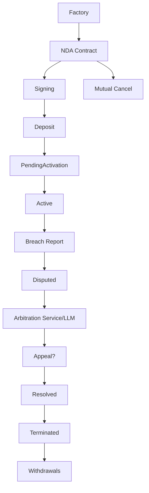

# אפיון חוזה NDATemplate – Production-Ready
## 0. הכרעות קונקרטיות לנקודות פתוחות
1. שינוי פרמטרים מערכתיים:
  - רק arbitrationService (immutable, ממשק ל-LLM/AI) יכול לשנות disputeFee, revealWindowSeconds, appealWindowSeconds, maxOpenReports.
  - אין צורך במנגנון החלפת בורר אנושי – arbitrationService הוא כתובת קבועה של שירות LLM/AI.

2. החלפת arbitrationService:
  - arbitrationService הוא ממשק ל-LLM/AI בלבד, immutable.
  - אין אפשרות להחליף בורר אנושי – כל ההחלטות מתקבלות ע"י LLM/AI.

3. מימון CCIP:
  - המגיש משלם את עלות CCIP (msg.value ב-reportBreach).
  - payFeesIn אופציונלי – ניתן להגדיר האם לשלם ב-ETH או בטוקן, לפי הגדרה ב-Factory.

4. הפעלת Active:
  - החוזה עובר ל-Active אוטומטית כאשר כל הצדדים חתמו והפקידו (כל פעולת deposit/signNDA בודקת תנאים).
  - Factory יכולה לקרוא activate() ידנית אם נדרש.

5. הקצאת תפקידים:
  - Factory קובעת Claimant/Defendant מראש לפי הגדרת הצדדים.
  - ניתן להחליף תפקידים רק בעת dispute, לפי דיווח.

6. מדיניות refunds על disputeFee:
  - disputeFee מוחזר אוטומטית למגיש אם הבוררות פסקה לטובתו.
  - אם הבוררות דוחה/לא פוסקת – העמלה נשארת אצל החוזה/בורר.

7. חובת הפקדת minDeposit:
  - כל צד חייב להפקיד לפחות minDeposit לפני הפעלה.
  - אם צד לא מפקיד עד deadline (למשל 7 ימים), ניתן להפעיל refundDeposits ולבטל את החוזה.

8. ניהול clauseHashes:
  - רק Factory יכולה להוסיף clauseHashes בעת יצירת החוזה.
  - אין אפשרות להוסיף/לשנות סעיפים לאחר יצירה.

9. פרטיות אירועים:
  - evidenceURI/hash באירועים – רק hash, לא URI מלא, אלא אם הוגדר במפורש ע"י הצדדים.
  - ניתן להגדיר אירועים פרטיים/מוצפנים אם נדרש.

10. סיום חוזה עם יתרות פתוחות:
  - בעת Terminated, כל withdrawable מחולק אוטומטית לצדדים.
  - כל צד יכול למשוך את יתרתו, או לקרוא finalizeWithdrawals (owner/Factory).
---
## 1. State Machine – ניהול מצבים
- enum ContractState { Draft, PendingActivation, Active, Disputed, Resolved, Terminated }
- זרימה:
  - יצירה → Draft
  - חתימות → PendingActivation
  - כל הצדדים חתמו והפקידו (באמצעות deposit עצמאית) → Active
  - dispute פתוח → Disputed (כל הפונקציות הלא-רלוונטיות נעולות ע"י modifier onlyWhenNotDisputed)
  - אחרי בוררות/אכיפה/ערעור → Resolved
  - אובדן פיקדון/סיום חוזה → Terminated
- modifier onlyWhenActive: מונע פעולות רגילות כשהחוזה ב-Draft או Terminated.
- פונקציה getStateString(): מחזירה מחרוזת מצב החוזה ל-UI.

## 2. פיקדונות וחתימות
- deposit() עצמאית, כל צד מפקיד לפני שהחוזה הופך ל-Active.
- signNDA רק מאשרת חתימה דיגיטלית, לא מבצעת הפקדה.
- Factory דואגת שכל צד יפקיד ויחתום לפני הפעלה (בודקת סטטוסי חתימה והפקדה).
- mapping(address => uint256) public partyDeposits; + hasDeposited.
- getTotalDeposited() לשקיפות.
- refundDeposits(): מאפשר החזרת פיקדונות אם החוזה בוטל בהסכמה או לא הופעל מעולם.
- הגבלת סכום: minDeposit ≤ amount ≤ maxDeposit.

## 3. ניהול תפקידים והרשאות
- enum Role { Unassigned, Claimant, Defendant }
- mapping(address => Role) public roles;
- modifiers: onlyClaimant, onlyDefendant, onlyParty.
- תפקידים מוגדרים מראש, אך ניתן להחליף בעת dispute.

## 4. דיווח, אנטי-ספאם ו־disputeFee
- reportBreach() היא payable, דורשת require(msg.value == disputeFee).
- refund disputeFee אם התלונה מוצדקת, או אם שולחים יותר מדי.
- respectReportInterval modifier + lastReportTime.
- openReports counter למניעת spam.

## 5. בוררות, אכיפה וערעור
- enum DisputeStatus { None, Open, Resolved }
- כל החלטה כוללת hash, penaltyAmount, beneficiary, resolvedAt timestamp.
- AppealWindow אמיתי: רק הצד שנפגע יכול לקרוא openAppeal(caseId), שמאריך את חלון הערעור.
- אם לא נפתח ערעור – החוזה עובר אוטומטית ל-Resolved.
- אירוע AppealResolved(caseId, bool upheld) אחרי החלטת ערעור (שירות LLM/AI קורא לפונקציה).
- אם penaltyAmount >= totalDeposit → החוזה נסגר אוטומטית (Terminated).

## 6. ביטול מוסכם (Mutual Cancel)
- mutualCancel() אפשרית רק לפני dispute פעיל.
- שני הצדדים חייבים לאשר תוך טווח זמן (למשל 24 שעות), נשמר timestamp לכל אישור.
- ביטול חד-צדדי אפשרי עם earlyTerminationFee.

## 7. אבטחת משיכות
- withdrawPayments() משתמש ב-withdrawableBalance, מוגן ב-nonReentrant.
- אפסית יתרה לפני העברת כספים.

## 8. אירועים ו־Frontend Sync
- אירועים עשירים:
  - ContractActivated(uint256 timestamp)
  - BreachReported(address indexed reporter, bytes32 proofHash, string uri)
  - ArbitrationResolved(uint256 caseId, address offender, uint256 penalty)
  - DepositMade(address indexed party, uint256 amount)
  - DepositWithdrawn(address indexed party, uint256 amount)
  - AppealOpened(uint256 caseId, uint256 deadline)
  - AppealResolved(uint256 caseId, bool upheld)
  - ContractTerminated(uint256 timestamp)
  - SignatureAdded(address indexed signer)
- כל שינוי משמעותי מפעיל אירוע מתאים.

## 9. ניהול סעיפים והוכחות
- mapping(bytes32 => bool) public clauseHashes – כל hash של סעיף מוגדר מראש.
- verifyClauseHash(bytes32 clauseHash): bool – אימות hash עבור frontend.
- כל הוכחה נשמרת כ-hash בלבד, הטקסט המלא off-chain (IPFS/Helia).

## 10. היסטוריית החלטות ושקיפות
- mapping(uint256 => DisputeRecord[]) public disputeHistory – מאפשר UI להציג היסטוריה מלאה.
- פונקציות getActiveCases(), getAllDisputes() לדשבורד בורר.

## 11. Factory – התנהגות
- Factory אחראית לפריסה, הגדרת צדדים, קביעת פיקדון, ושמירה על סטטוסי חתימה/הפקדה.
- Factory בודקת שכל צד חתם והפקיד לפני שהחוזה הופך ל-Active.
- Factory לא מתערבת בלוגיקת dispute/appeal, רק בניהול ראשוני.

## 12. אבטחה כללית וסיכוני ארכיטקטורה
- כל פונקציה קריטית מוגנת ב-modifier מתאים ובדיקת access control כפולה.
- כל פונקציה שמעבירה ETH (withdrawPayments, CCIP) מוגנת ב-nonReentrant והסדר state update לפני external call.
- אין אפשרות להפקיד/לחתום/לדווח אחרי סיום החוזה או בזמן dispute.
- יש להגביל הכנסת ETH רק ל-deposit/reportBreach/CCIP calls.
- בדיקות overflow/underflow בכל חישוב סכום.
- הגנה על DoS ע"י הגבלת גודל מערכים (pagination ב-getAllDisputes/getActiveCases).
- שימוש ב-block.timestamp רק ל-deadlines, לא להחלטות קריטיות.
- הגנה על שימוש זדוני ב-CCIP (rate-limit, תשלום חובה).
- rationale/decisionHash גדולים – לשמור off-chain.

---

## 13. תוספות מומלצות
- Emergency pause/circuit breaker (pause() ע"י owner/admin).
- אירועים עשירים ומקודדים (indexed) – BreachReported, ArbitrationResolved עם שדות נוספים.
- Pagination בשיטות שליפת רשימות.
- אופטימיזציית גז – שימוש ב-calldata, uint32/uint48 ל-timestamps.
- אימות Merkle on-chain (אופציונלי).
- מנגנון החלפת arbitrationService מפוקח (multi-sig/timelock).
- Audit hooks – decisionHash + CID.
- Fee-sweep/Treasury – טיפול בעמלות arbitrationService.

---

## 14. Acceptance Checklist – תנאי קבלה לפני פריסה

### פונקציונליות
- בדיקות יחידה לכל מצב במכונת המצבים.
- בדיקות משולבות עם Factory.
- בדיקות חתימה EIP712.
- בדיקות deposit/withdraw/refundDeposits (כולל edge cases).
- בדיקות reportBreach עם rate-limit/openReports/disputeFee.
- בדיקות serviceResolve/applyResolution/finalizeEnforcement (כולל appealWindow).
- בדיקות CCIP trigger (mock).
- בדיקות Merkle flow (אם קיים).
- בדיקות mutualCancel/earlyTerminationFee/refundDeposits.

### אבטחה
- בדיקות reentrancy (withdrawPayments, serviceEnforce).
- בדיקות access control (רטורן בכישלון כשמשתמש לא מורשה).
- בדיקות DoS (יצירת הרבה תיקים, pagination).
- בדיקות call value handling.

### ביצועים / גז
- הערכת גז לפונקציות כבדות.
- בדיקה ש-Factory לא הופכת לגדולה מדי.

### ממשק/Frontend
- specification of events/field types for frontend (כולל indexed fields).
- דוקומנטציה של flow ל-frontend.
- סדר פעולות: מי קורא למי (Factory vs contract).

### רגולציה & פרטיות
- בחינת אירועים – האם חושפים מידע רגיש.
- מדיניות אחסון/שיתוף proof URIs.

### אבטחת צד שלישי
- בדיקת ממשק CCIP/arbitrationSender.
- mock לשימוש בפיתוח.

### Audit & Review
- רבעון קוד פנימי + peer review.
- audit חיצוני לפני mainnet.

---

---

## דיאגרמת זרימה (Mermaid)

---

## יתרונות השיפורים
- הפרדה ברורה בין חתימה להפקדה
- נעילה בזמן dispute
- מנגנון ערעור מוגדר היטב
- ביטול מוסכם בטוח
- אירועים ושקיפות מלאים
- אבטחה גבוהה
- Factory מודולרי ומוכן להתרחבות

---

